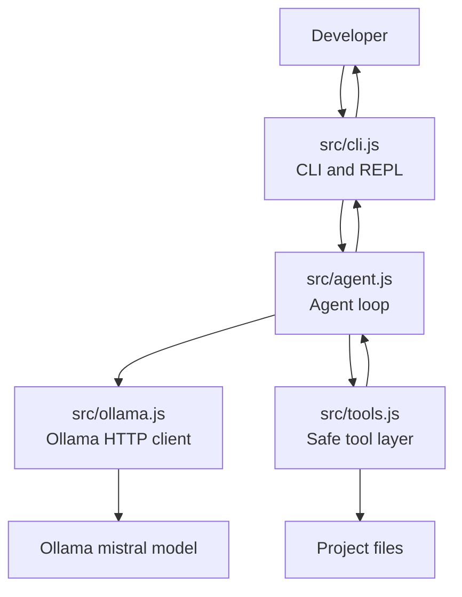

# Architecture and Developer KT

## Project Overview

This project is a local personal coding agent written in JavaScript. It uses Ollama with the `mistral` model to answer developer questions about a project, inspect local files through a controlled tool layer, and propose code changes as unified diffs.

The main design choice is safety first: the agent can inspect files and suggest patches, but it does not automatically write source files. A human developer reviews any proposed patch before applying it.

Typical user goals:

- Explain a function or file.
- Find possible bugs.
- Suggest refactors.
- Search the codebase.
- Propose a patch without applying it.

## High-Level Architecture



The CLI receives the user request. The agent sends a prompt to Ollama, receives a JSON action from the model, and either runs one of the allowed tools or returns a final answer. Tool results are appended back into the conversation so the model can reason from actual project context.

## Repository Structure

```text
.
├── README.md
├── ARCHITECTURE_KT.md
├── package.json
└── src
    ├── agent.js
    ├── cli.js
    ├── ollama.js
    └── tools.js
```

## File Responsibilities

### `package.json`

Defines the Node.js package metadata and scripts.

Important fields:

- `type: "module"` enables ES module syntax.
- `bin.coding-agent` points to `src/cli.js`, so the CLI can be exposed as `coding-agent`.
- `scripts.start` runs the agent CLI.
- `scripts.check` runs Node syntax checks for all source files.
- `engines.node` requires Node.js 18 or newer because the project uses built-in `fetch`.

There are currently no third-party runtime dependencies.

### `src/cli.js`

This is the command-line entrypoint.

Responsibilities:

- Parse CLI arguments.
- Choose the project root.
- Choose the Ollama model.
- Run either one-shot mode or interactive REPL mode.
- Print errors with a helpful Ollama hint when local model access fails.

Supported options:

- `--root <path>`: project directory to inspect. Defaults to the current working directory.
- `--model <name>`: Ollama model name. Defaults to `OLLAMA_MODEL` or `mistral`.
- `--verbose`: prints model actions to stderr for debugging.
- `--help`: prints usage.

Execution modes:

- One-shot mode: `npm start -- "Explain src/tools.js"`
- REPL mode: `npm start`

### `src/agent.js`

This is the core orchestration layer.

Responsibilities:

- Build the system prompt.
- Define the model action protocol.
- Send prompts to Ollama.
- Parse the model response as JSON.
- Dispatch approved tool calls.
- Feed tool results back into the conversation.
- Stop after a fixed number of steps.

The main export is:

```js
runAgent({ goal, root, model, verbose })
```

The agent loop allows up to `MAX_STEPS = 8`. This prevents runaway model/tool loops.

The model must return one JSON object in one of two shapes:

```json
{"type":"tool","name":"read_file","arguments":{"path":"src/example.js"}}
```

or:

```json
{"type":"final","answer":"Final response to the developer."}
```

If the model returns invalid JSON, the agent does not crash immediately. It records a tool-style error message and asks the model to try again in the next step.

### `src/ollama.js`

This file contains the local Ollama API client.

Responsibilities:

- Send requests to Ollama's `/api/generate` endpoint.
- Use non-streaming responses for simpler CLI handling.
- Set a low default temperature for more deterministic coding behavior.
- Surface non-200 Ollama responses as JavaScript errors.

Default configuration:

- Base URL: `http://127.0.0.1:11434`
- Model: `mistral`
- Temperature: `0.2`

Environment variables:

- `OLLAMA_MODEL`: overrides the default model.
- `OLLAMA_BASE_URL`: overrides the Ollama server URL.

### `src/tools.js`

This file implements the controlled filesystem tool layer.

The exported factory is:

```js
createTools({ root })
```

It returns the tool allowlist used by the agent.

Available tools:

| Tool | Purpose | Writes Files |
| --- | --- | --- |
| `list_files` | Lists files under the project root. | No |
| `read_file` | Reads one UTF-8 file inside the project root. | No |
| `search_text` | Searches project files for a string or regex. | No |
| `propose_patch` | Returns a patch proposal object. | No |

The important safety helper is:

```js
safeResolve(root, requestedPath)
```

It resolves a requested path against the project root and rejects paths that escape the root, such as `../outside`.

## Request Lifecycle

1. The developer runs the CLI.
2. `src/cli.js` parses arguments and calls `runAgent`.
3. `src/agent.js` creates the safe tools for the selected root.
4. The agent builds a system prompt describing the rules and tools.
5. The prompt is sent to Ollama through `src/ollama.js`.
6. Mistral returns a JSON action.
7. If the action is `tool`, the agent validates the tool name against the local allowlist.
8. The tool runs and returns structured data.
9. The result is added to the message history.
10. The loop continues until the model returns `final` or hits the step limit.

## Tool-Calling Design

This project uses a simple JSON action protocol instead of provider-native tool calling. That keeps the implementation portable and easy to inspect.

The protocol is intentionally small:

- The model can only ask for a tool by returning `type: "tool"`.
- The tool name must exist in the locally constructed allowlist.
- Tool arguments are passed as plain JSON.
- Tool results are returned to the model as JSON.
- Final answers must use `type: "final"`.

This makes the agent loop understandable for new developers and avoids hidden behavior.

## Safety Model

The project has several safety boundaries.

### No Automatic Writes

The agent never modifies source files. The `propose_patch` tool returns:

```json
{
  "summary": "Proposed change",
  "patch": "...",
  "applied": false,
  "note": "Patch proposal only. Review before applying."
}
```

This is the central safety rule of the project.

### Root-Scoped File Access

All file paths go through `safeResolve`. If a path escapes the selected project root, the tool throws an error.

Blocked example:

```text
../outside
```

Allowed example:

```text
src/tools.js
```

### Fixed Tool Allowlist

The model cannot invent tools. `runAgent` checks `tools[action.name]` before execution.

If the model asks for an unknown tool, the agent returns an error and includes the allowed tool names.

### File Size Limits

The tool layer avoids reading very large files into the model context.

Current limits:

- `MAX_READ_BYTES = 80_000`
- `MAX_SEARCH_FILE_BYTES = 250_000`

### Ignored Directories

File listing skips common generated or heavy directories:

- `.git`
- `node_modules`
- `dist`
- `build`
- `coverage`
- `.next`
- `.turbo`
- `.cache`

### Step Limit

The agent stops after 8 model/tool iterations. This avoids infinite loops and keeps cost/time predictable, even though Ollama is local.

## Setup for a New Developer

Install prerequisites:

```sh
ollama pull mistral
ollama serve
```

Run the project:

```sh
npm start
```

Ask a one-shot question:

```sh
npm start -- "Explain src/agent.js"
```

Inspect another project:

```sh
npm start -- --root /path/to/project "Find bugs in the main entrypoint"
```

Use a different local model:

```sh
npm start -- --model mistral:latest "Suggest refactors"
```

Run syntax checks:

```sh
npm run check
```

## Common Developer Tasks

### Add a New Tool

1. Open `src/tools.js`.
2. Add a new entry to the object returned by `createTools`.
3. Include a clear `description`.
4. Include a simple `parameters` object so the model knows how to call it.
5. Implement `run(args)`.
6. Keep the tool root-scoped and read-only unless the project safety policy changes.
7. Run `npm run check`.

Example shape:

```js
new_tool_name: {
  description: "Explain what this tool does.",
  parameters: {
    path: "Path relative to project root."
  },
  run: async ({ path }) => {
    return { result: "..." };
  }
}
```

Because `src/agent.js` builds tool descriptions dynamically from `createTools`, new tools automatically appear in the system prompt.

### Change the Agent Prompt

Edit `buildSystemPrompt` in `src/agent.js`.

Be careful with this file because the model behavior depends heavily on prompt wording. Keep these requirements intact:

- Reply with exactly one JSON object.
- Use tools before making project-specific claims.
- Never claim a patch was applied.
- Use `propose_patch` for suggested edits.

### Change Ollama Settings

Edit `src/ollama.js` to adjust:

- Default base URL
- Default temperature
- Request options
- Ollama endpoint behavior

For most model changes, prefer CLI or environment configuration instead:

```sh
OLLAMA_MODEL=mistral:latest npm start
```

### Improve Patch Handling

Today, `propose_patch` only returns the proposed diff. A future version could add a separate `apply_patch` command, but that should be gated behind explicit user confirmation.

Recommended safe path:

1. Keep `propose_patch` read-only.
2. Add a separate CLI command for applying a reviewed patch.
3. Require explicit confirmation before writing.
4. Show the exact files that will change.
5. Add tests around path safety and patch application.

## Debugging Guide

### Ollama Is Not Running

Symptom:

```text
Error: fetch failed
Is Ollama running? Try: ollama serve
```

Fix:

```sh
ollama serve
```

### Model Not Found

Symptom:

```text
Ollama request failed: 404
```

Fix:

```sh
ollama pull mistral
```

or run with an installed model:

```sh
npm start -- --model llama3.1 "Explain the project"
```

### Model Returns Invalid JSON

The agent already handles this by feeding back an error and asking for a valid JSON object. If it happens often:

- Run with `--verbose`.
- Lower temperature in `src/ollama.js`.
- Tighten `buildSystemPrompt`.
- Try a model that follows structured instructions better.

### Tool Cannot Read a File

Possible causes:

- The path escapes the project root.
- The file is too large.
- The path points to a directory.
- The file is binary or not UTF-8 text.

## Current Limitations

- No automated tests yet.
- No native Ollama tool-calling API integration.
- No streaming output.
- Search is implemented in JavaScript, not through `ripgrep`.
- Regex search uses JavaScript `RegExp`, so invalid regex patterns throw errors.
- Patch proposals are not validated as real diffs.
- The REPL does not preserve conversation across separate user questions; each question starts a fresh agent run.

## Recommended Next Improvements

1. Add unit tests for `safeResolve`, `list_files`, `read_file`, and `search_text`.
2. Add a patch validation helper that checks whether proposed diffs reference files inside the project root.
3. Add optional conversation memory inside the REPL.
4. Add streaming response support for better UX.
5. Add richer file filtering for binary files and lockfiles.
6. Add a confirmation-based patch apply workflow.
7. Add model capability notes for Mistral versus other local models.

## Handover Notes

The most important files for a new developer are:

- Start with `src/cli.js` to understand how users enter the system.
- Read `src/agent.js` to understand the control loop.
- Read `src/tools.js` carefully because it is the security boundary.
- Read `src/ollama.js` to understand the only model integration point.

When changing behavior, prefer small changes and keep the safety principle intact: inspect and propose first, write only after explicit human approval.
